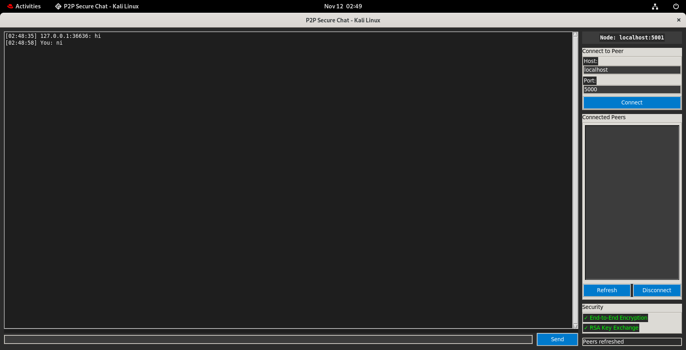
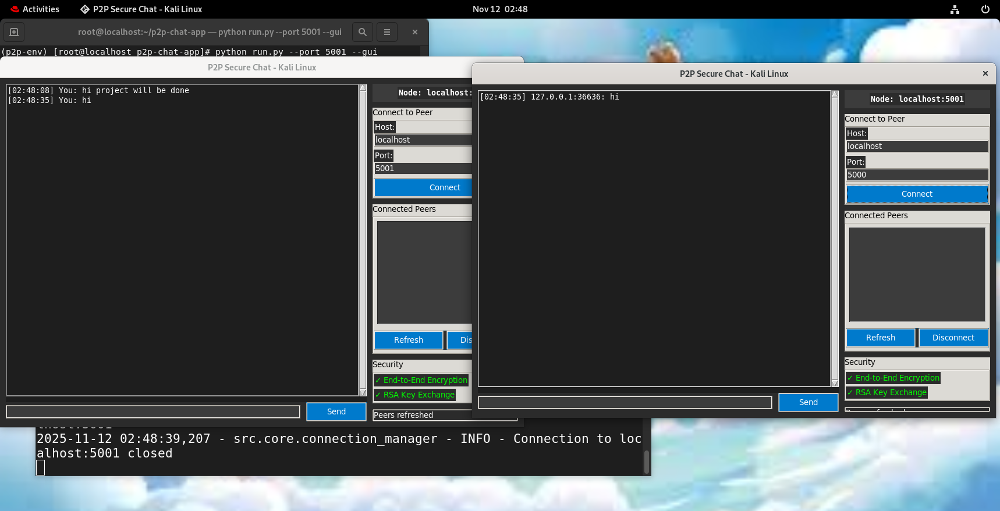
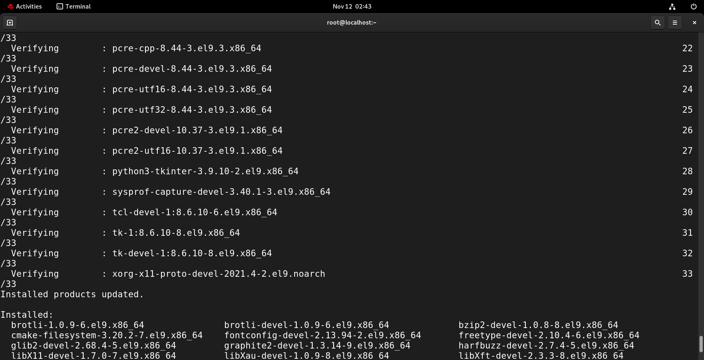
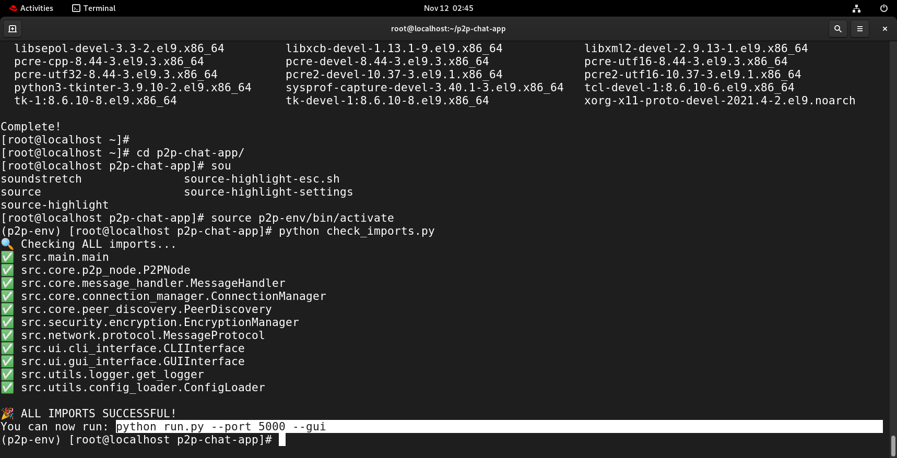

# 🔒 P2P Secure Chat Application


**College Minor Project** - Computer Science Department  
*A fully functional Peer-to-Peer encrypted chat application built for Red Hat Linux.*

---

## 🚀 Features

- 🔄 **True P2P Architecture** - No central server required
- 🔒 **End-to-End Encryption** - Secure message transmission using AES-256
- 🎨 **Dual Interface** - Both GUI (Tkinter) and CLI interfaces
- 🌐 **Network Discovery** - Automatic peer discovery and connection
- 📱 **Real-time Messaging** - Instant message delivery between peers
- 🐧 **Red Hat Optimized** - Specifically tested on RHEL/CentOS/Fedora

---

## 📸 Demo

### GUI Interface


### CLI Interface


### Architecture


### Architecture


---

## 🛠️ Quick Start

### Prerequisites
- Red Hat Linux 8+ / CentOS 8+ / Fedora 30+
- Python 3.8+
- Git

### Installation & Run
```bash
# Clone repository
git clone https://github.com/Alaysolver/p2p-chat-app.git
cd p2p-chat-app

# Install dependencies
chmod +x scripts/install_dependencies.sh
./scripts/install_dependencies.sh

# Start application (GUI)
./scripts/start_gui.sh

# Or start CLI version
python run.py --port 5000
